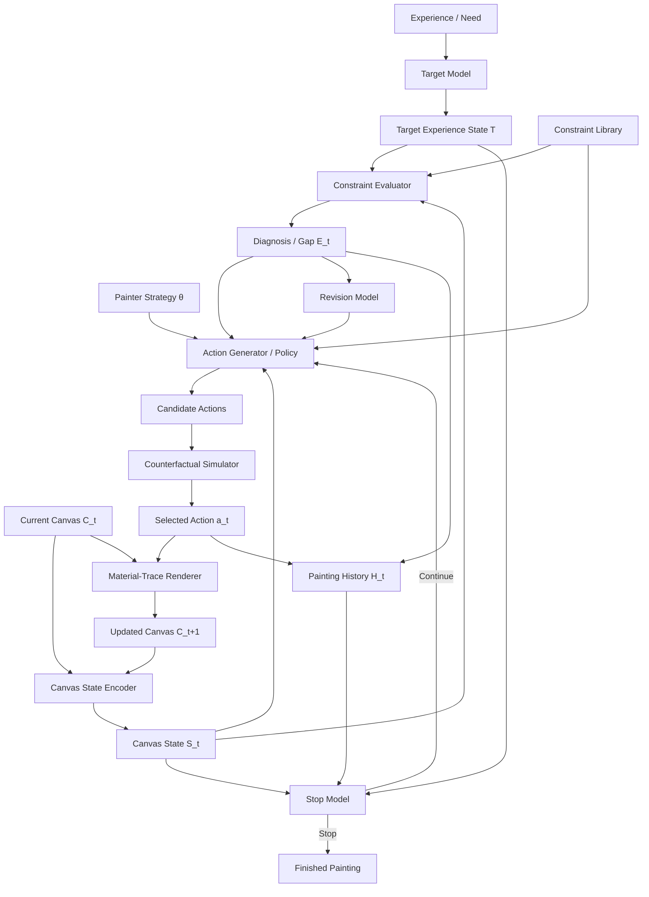

# human-painting-mechanism-modeling

## Overview
A computational framework for modeling human painting as process, action, material, and judgment.

## Research Motivation
当下以图像结果层面的统计关联为核心的AI生成图像技术，在纯艺术绘画领域的应用和发展，存在结构性限制。表现在画面元素在视觉特征的相关性层面被考察，而非因果性，导致没有内部关系连续性的画面元素会被强行组织在一起，形成视觉风格相似但内部造型关系错误、难以通过人类专家检验的，所谓“AI式绘画”。

## Core Idea
绘画的视觉表现不是对视觉的满足，而是对以视觉为信息入口的身体的满足。

## Framework

    
## Modules
列出 Target Model、Canvas State、Action Model、Material Function、Evaluator、Stop Model。

## Current Prototypes
列出 balance analyzer 和 brush action model。

## Roadmap
v0.1 / v0.2 / v0.3。

## Status
说明 early-stage research prototype。
